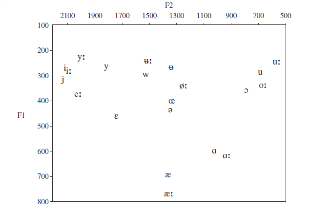

# Vowel chart
https://en.wikipedia.org/wiki/Norwegian_phonology

# F1/F2 formants
https://en.wikipedia.org/wiki/Norwegian_phonology

Kristoffersen, Gjert (2000), The Phonology of Norwegian, Oxford University Press
[document.pdf](document.pdf)

https://en.wikipedia.org/wiki/Help:IPA/Norwegian

# Alphabet
https://testcalst.hf.ntnu.no/sfiles/Norwegian/Words_MP3/Bergen_Normal_GA1Y4BUUFHZ2ZKTK.mp3#A
https://testcalst.hf.ntnu.no/sfiles/Norwegian/Words_MP3/Bergen_Normal_4QR8IUMN2LKBWKAB.mp3#B
https://testcalst.hf.ntnu.no/sfiles/Norwegian/Words_MP3/Bergen_Normal_BG9Y9TNHXYXOMPAL.mp3#C
https://testcalst.hf.ntnu.no/sfiles/Norwegian/Words_MP3/Bergen_Normal_WVY37QUCR83IC5GU.mp3#D
https://testcalst.hf.ntnu.no/sfiles/Norwegian/Words_MP3/Bergen_Normal_XHR7YLZNS6MOR5RQ.mp3#E
https://testcalst.hf.ntnu.no/sfiles/Norwegian/Words_MP3/Bergen_Normal_BAXJPNW1HZT8SEFD.mp3#F
https://testcalst.hf.ntnu.no/sfiles/Norwegian/Words_MP3/Bergen_Normal_3SAANNZG5OTATZBZ.mp3#G
https://testcalst.hf.ntnu.no/sfiles/Norwegian/Words_MP3/Bergen_Normal_ILFNEPWUUH0UV80L.mp3#H
https://testcalst.hf.ntnu.no/sfiles/Norwegian/Words_MP3/Bergen_Normal_I79Q5K15VFJ0A8AH.mp3#I
https://testcalst.hf.ntnu.no/sfiles/Norwegian/Words_MP3/Bergen_Normal_0IEMGJQXR0CD0PVR.mp3#J
https://testcalst.hf.ntnu.no/sfiles/Norwegian/Words_MP3/Bergen_Normal_5PXTMJZDFM4X1MYD.mp3#K
https://testcalst.hf.ntnu.no/sfiles/Norwegian/Words_MP3/Bergen_Normal_N3S7TQ0XR3KVPSGP.mp3#L
https://testcalst.hf.ntnu.no/sfiles/Norwegian/Words_MP3/Bergen_Normal_XD69730MQBHPZIIQ.mp3#M
https://testcalst.hf.ntnu.no/sfiles/Norwegian/Words_MP3/Bergen_Normal_DQ8XLIVUJZ9RKEA5.mp3#N
https://testcalst.hf.ntnu.no/sfiles/Norwegian/Words_MP3/Bergen_Normal_BD62N319Y72ORH28.mp3#O
https://testcalst.hf.ntnu.no/sfiles/Norwegian/Words_MP3/Bergen_Normal_CMUA5TBUZ33ZLHN1.mp3#P
https://testcalst.hf.ntnu.no/sfiles/Norwegian/Words_MP3/Bergen_Normal_05A2EJFE23DTF51U.mp3#Q
https://testcalst.hf.ntnu.no/sfiles/Norwegian/Words_MP3/Bergen_Normal_FHJ0084BCYFYYQ3B.mp3#R
https://testcalst.hf.ntnu.no/sfiles/Norwegian/Words_MP3/Bergen_Normal_GQ77IYEWEUH9SQO4.mp3#S
https://testcalst.hf.ntnu.no/sfiles/Norwegian/Words_MP3/Bergen_Normal_1OYYCJEAU5IOZI97.mp3#T
https://testcalst.hf.ntnu.no/sfiles/Norwegian/Words_MP3/Bergen_Normal_3ERZLGAYK0GWGF1Q.mp3#U
https://testcalst.hf.ntnu.no/sfiles/Norwegian/Words_MP3/Bergen_Normal_ITRF3CCNAR6MWO09.mp3#V
https://testcalst.hf.ntnu.no/sfiles/Norwegian/Words_MP3/Bergen_Normal_GGPK5XI2PZZJ3SRD.mp3#W
https://testcalst.hf.ntnu.no/sfiles/Norwegian/Words_MP3/Bergen_Normal_XWHQEKQ2XJE6MCGT.mp3#X
https://testcalst.hf.ntnu.no/sfiles/Norwegian/Words_MP3/Bergen_Normal_FTGQGEJ5V2PPRTBZ.mp3#Y
https://testcalst.hf.ntnu.no/sfiles/Norwegian/Words_MP3/Bergen_Normal_8YML6ASUKP8W7EHI.mp3#Z
https://testcalst.hf.ntnu.no/sfiles/Norwegian/Words_MP3/Bergen_Normal_AOFMF7OIAK64OB91.mp3#Æ
https://testcalst.hf.ntnu.no/sfiles/Norwegian/Words_MP3/Bergen_Normal_9V9346SSTNJJF15W.mp3#Ø
https://testcalst.hf.ntnu.no/sfiles/Norwegian/Words_MP3/Bergen_Normal_LSAZ2422CMOF627R.mp3#Å

# i & I:
beat bit
bieten bitten
bite bitt
бить бетон, быть

#  ye & ye:
bed bear

# e & e:

# oe & yo:

# Y

# u

# u: