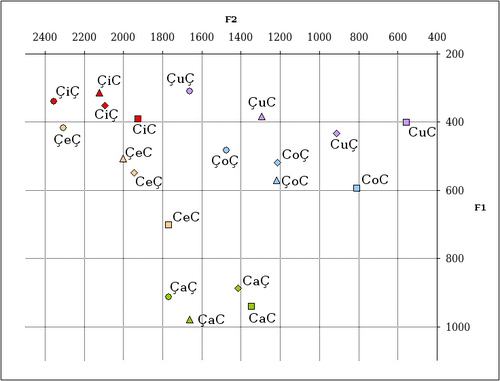
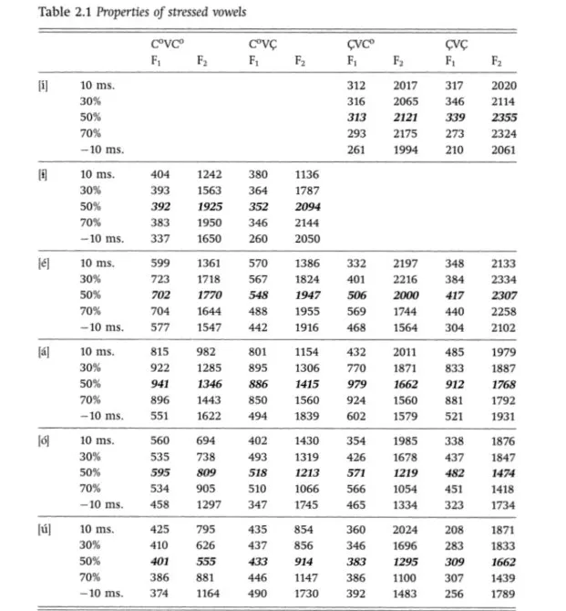
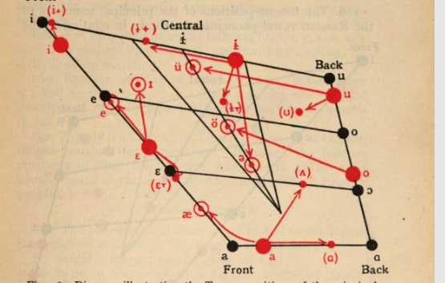

F1/F2:
https://books.google.de/books?id=-VFNWqXxRoMC&pg=PA28&redir_esc=y#v=onepage&q&f=false

Vowel chart:

https://books.google.de/books?id=Txw9AAAAIAAJ&redir_esc=y

https://en.wikipedia.org/wiki/Help:IPA/Russian

https://www.youtube.com/watch?v=BZkcIPfZ6Is
Vowels: i ɨ u ɛ o a
Reduced ɐ ə ʊ ɪ
palatalized æ ʉ ɵ e
velarized ɑ

Alphabet:
https://www.russianforeveryone.com/RufeA/Lessons/Introduction/Alphabet/Sound1.mp3#а
https://www.russianforeveryone.com/RufeA/Lessons/Introduction/Alphabet/Sound2.mp3#б
https://www.russianforeveryone.com/RufeA/Lessons/Introduction/Alphabet/Sound3.mp3#в
https://www.russianforeveryone.com/RufeA/Lessons/Introduction/Alphabet/Sound4.mp3#г
https://www.russianforeveryone.com/RufeA/Lessons/Introduction/Alphabet/Sound5.mp3#д
https://www.russianforeveryone.com/RufeA/Lessons/Introduction/Alphabet/Sound6.mp3#е
https://www.russianforeveryone.com/RufeA/Lessons/Introduction/Alphabet/Sound7.mp3#ё
https://www.russianforeveryone.com/RufeA/Lessons/Introduction/Alphabet/Sound8.mp3#ж
https://www.russianforeveryone.com/RufeA/Lessons/Introduction/Alphabet/Sound9.mp3#з
https://www.russianforeveryone.com/RufeA/Lessons/Introduction/Alphabet/Sound10.mp3#и
https://www.russianforeveryone.com/RufeA/Lessons/Introduction/Alphabet/Sound11.mp3#й
https://www.russianforeveryone.com/RufeA/Lessons/Introduction/Alphabet/Sound12.mp3#к
https://www.russianforeveryone.com/RufeA/Lessons/Introduction/Alphabet/Sound13.mp3#л
https://www.russianforeveryone.com/RufeA/Lessons/Introduction/Alphabet/Sound14.mp3#м
https://www.russianforeveryone.com/RufeA/Lessons/Introduction/Alphabet/Sound15.mp3#н
https://www.russianforeveryone.com/RufeA/Lessons/Introduction/Alphabet/Sound16.mp3#о
https://www.russianforeveryone.com/RufeA/Lessons/Introduction/Alphabet/Sound17.mp3#п
https://www.russianforeveryone.com/RufeA/Lessons/Introduction/Alphabet/Sound18.mp3#р
https://www.russianforeveryone.com/RufeA/Lessons/Introduction/Alphabet/Sound19.mp3#с
https://www.russianforeveryone.com/RufeA/Lessons/Introduction/Alphabet/Sound20.mp3#т
https://www.russianforeveryone.com/RufeA/Lessons/Introduction/Alphabet/Sound21.mp3#у
https://www.russianforeveryone.com/RufeA/Lessons/Introduction/Alphabet/Sound22.mp3#ф
https://www.russianforeveryone.com/RufeA/Lessons/Introduction/Alphabet/Sound23.mp3#х
https://www.russianforeveryone.com/RufeA/Lessons/Introduction/Alphabet/Sound24.mp3#ц
https://www.russianforeveryone.com/RufeA/Lessons/Introduction/Alphabet/Sound25.mp3#ч
https://www.russianforeveryone.com/RufeA/Lessons/Introduction/Alphabet/Sound26.mp3#ш
https://www.russianforeveryone.com/RufeA/Lessons/Introduction/Alphabet/Sound27.mp3#щ
https://www.russianforeveryone.com/RufeA/Lessons/Introduction/Alphabet/Sound28.mp3#ъ
https://www.russianforeveryone.com/RufeA/Lessons/Introduction/Alphabet/Sound29.mp3#ы
https://www.russianforeveryone.com/RufeA/Lessons/Introduction/Alphabet/Sound30.mp3#ь
https://www.russianforeveryone.com/RufeA/Lessons/Introduction/Alphabet/Sound31.mp3#э
https://www.russianforeveryone.com/RufeA/Lessons/Introduction/Alphabet/Sound32.mp3#ю
https://www.russianforeveryone.com/RufeA/Lessons/Introduction/Alphabet/Sound33.mp3#я